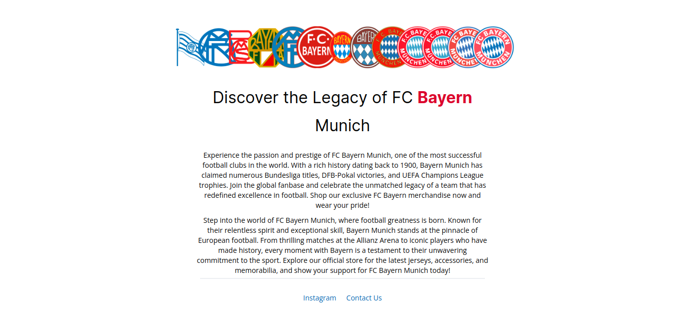

# FCB flyer

### Project created to practice HTML and CSS

### Key points
 - How to use fonts from the web
 - Element positioning
 - Apply margins
 - Use of ids and classes
 - Image positioning
 - Use of colors
 - Formatting and styling texts

